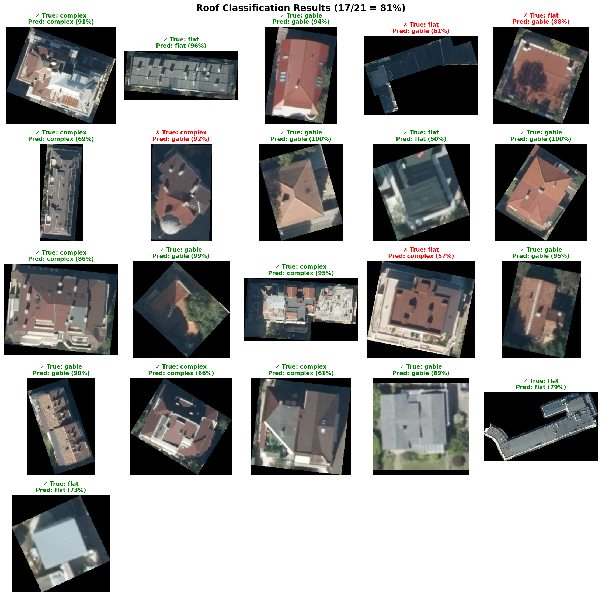
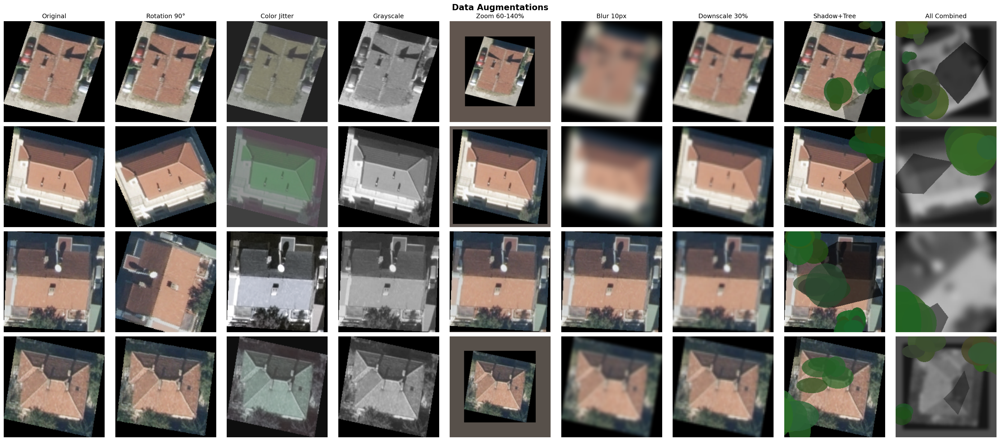

# Roofline

A PyTorch CNN for classifying roof types from satellite/aerial imagery.

## Classes

| Class | Description |
|-------|-------------|
| `flat` | Flat roofs |
| `gable` | Gable, hip, and other pitched roofs |
| `complex` | Complex roof structures |

Note: The original dataset included a "bug" category for imagery artifacts, but this was removed as it did not match our target domain requirements.

## Example Results



## Installation

```bash
# Clone the repository
git clone https://github.com/notsambeck/roofline.git
cd roofline

# Install with uv
uv sync

# Or with pip
pip install -e .
```

## Usage

```python
from roofline import RoofClassifier
from PIL import Image

# Load classifier (uses bundled weights if available)
classifier = RoofClassifier()

# Classify a single image
img = Image.open("roof.tif")
result = classifier.classify(img)
# {"class": "gable", "confidence": 0.92, "probabilities": {...}}

# Classify a batch of images
results = classifier.classify_batch([img1, img2, img3])
```

### Custom model weights

```python
classifier = RoofClassifier(model_path="path/to/your/model.pt")
```

## Training

Train on your own dataset:

```bash
uv run python -m roofline.train --data /path/to/dataset --epochs 20 --output weights/model.pt
```

Expected dataset structure:
```
dataset/
├── flat/
├── gable/
└── complex/
```

### Training options

| Option | Default | Description |
|--------|---------|-------------|
| `--data` | required | Path to dataset directory |
| `--output` | `weights/model.pt` | Output model path |
| `--epochs` | 20 | Number of training epochs |
| `--batch-size` | 32 | Batch size |
| `--lr` | 0.001 | Learning rate |
| `--val-split` | 0.2 | Validation split ratio |
| `--device` | auto | Device (cuda/mps/cpu) |
| `--resume` | none | Path to checkpoint to resume training from |

## Data Augmentation

Aggressive augmentation is applied during training for domain generalization:



| Augmentation | Probability | Parameters |
|--------------|-------------|------------|
| Horizontal/Vertical Flip | 50% | - |
| Rotation | 100% | ±90° |
| Color Jitter | 100% | brightness=0.2, contrast=0.8, saturation=1.0, hue=0.5 |
| Grayscale | 30% | - |
| Random Zoom | 30% | 60-140% scale |
| Gaussian Blur | 50% | up to 10px radius |
| Downscale | 50% | 30-100% (simulates low-res) |
| Shadow | 30% | up to 40% coverage |
| Tree Occlusion | 50% | up to 90% coverage |
| Random Erasing | 30% | 2-20% area |

## Model Architecture

Fine-tuned ResNet18 pretrained on ImageNet, with a custom classifier head:

```
ResNet18 (ImageNet pretrained, fine-tuned)
  │
  └─ fc: Dropout(0.5) → Linear(512→3)

Output: 3 class logits
```

Training uses differential learning rates to preserve pretrained features while adapting to roof imagery:
- Backbone: 0.1x learning rate
- Classifier head: 1.0x learning rate

## Development

```bash
# Run tests
uv run pytest tests/

# Run visual test on sample images
uv run python scripts/visual_test.py
```

## Dataset

Training data combines:
- **Sofia, Bulgaria**: "Imagery dataset for rooftop detection and classification" - 3,157 GeoTIFF images (10 cm/pixel resolution, 2020)
- **Portland, Oregon**: Additional samples for domain diversity

> Hristov, E., Petrova-Antonova, D., Petrov, A., Borukova, M., & Shirinyan, E. (2023). *Imagery dataset for rooftop detection and classification* [Data set]. Zenodo. https://doi.org/10.5281/zenodo.7633594

## License

MIT License

## Citation

If you use this code in your research, please cite both this repository and the dataset:

```bibtex
@software{roofline,
  title = {Roofline: Roof Type Classifier},
  url = {https://github.com/notsambeck/roofline}
}

@dataset{hristov_2023_7633594,
  author = {Hristov, Emil and Petrova-Antonova, Dessislava and Petrov, Alexander and Borukova, Milena and Shirinyan, Evgeny},
  title = {Imagery dataset for rooftop detection and classification},
  year = {2023},
  publisher = {Zenodo},
  doi = {10.5281/zenodo.7633594},
  url = {https://doi.org/10.5281/zenodo.7633594}
}
```
